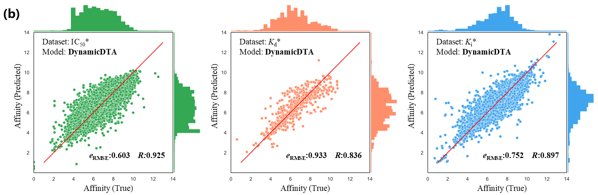

# DynamicDTA
DynamicDTA: drug-target binding affinity prediction using dynamics descriptors and graph representation


## Methods: 


DynamicDTA
integrates protein dynamics descriptors, which are derived from molecular dynamics simulations, offering a more comprehensive understanding of protein behavior. 

## Running DynamicDTA

### Prerequisites

Before running **DynamicDTA**, make sure you have **Anaconda** or **Miniconda** installed on your machine.


### Setting Up the Environment

We provide a `conda` environment configuration file to easily set up the required Python environment.

To create a virtual environment with the necessary dependencies, follow these steps:

1. Download or clone the repository:

   ```bash
   git clone https://github.com/shmily-ld/DynamicDTA.git
   cd DynamicDTA
   ```

2. Create the environment using the provided `environment.yml` file:

   ```bash
   conda env create -f environment.yml
   ```

   This will create a conda environment with all the required libraries and dependencies.

3. Activate the conda environment:

   ```bash
   conda activate ld
   ```


### Dataset Preparation

```bash
python data_preprocessing.py
```

Once the preprocessing is complete, you will find a folder named `processed` under the `data` directory. This folder contains the data in PyTorch format, which can be used for training and evaluation with the **DynamicDTA** model.


### Training and Evaluation

```bash
python training.py
```

During training, the model will automatically check for the availability of a GPU. If a GPU is detected, it will use it for training to speed up the process. If no GPU is available, the model will fall back to using the CPU. Make sure that you have the necessary CUDA setup if you plan to use a GPU.


### Visualization

```bash
python visualization.py
```

After running the script, you will see images like the one shown below, which represent the visualized predictions and results of the model. This helps to analyze and interpret the performance of the trained model more effectively.


